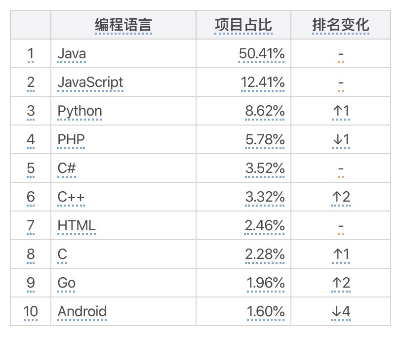
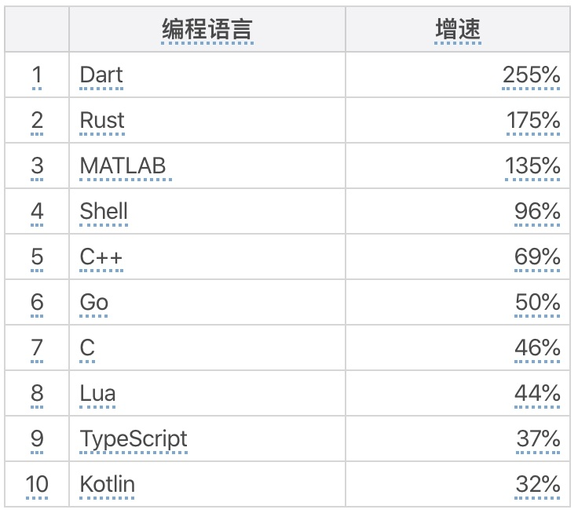
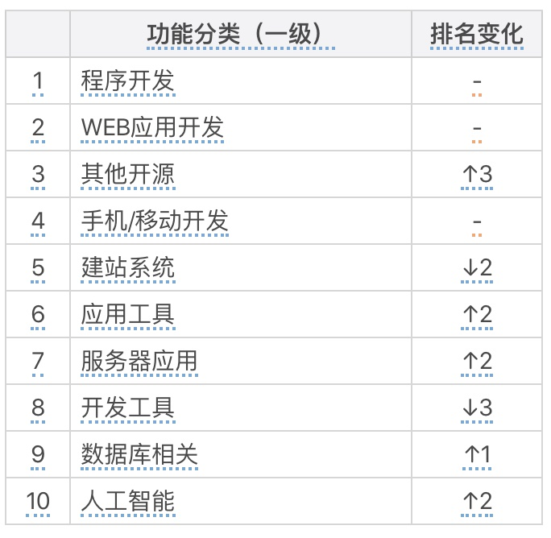
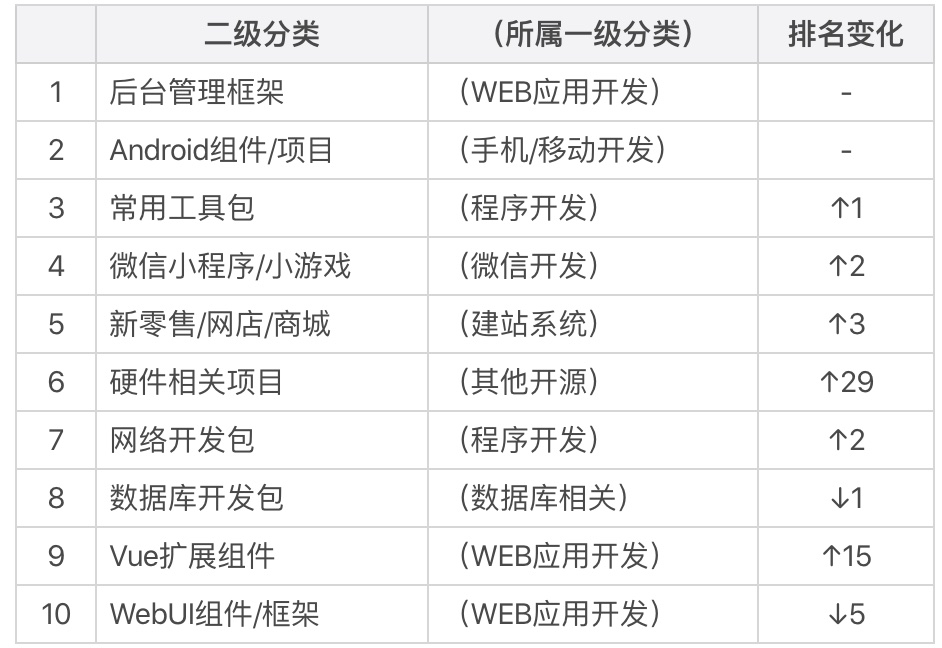
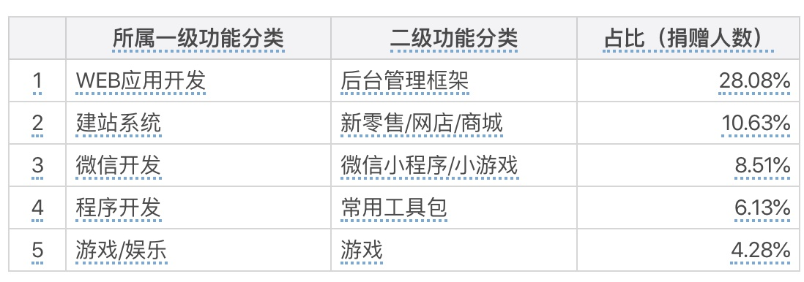
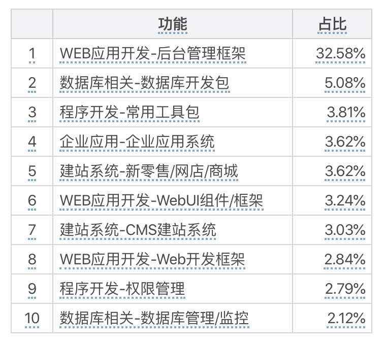
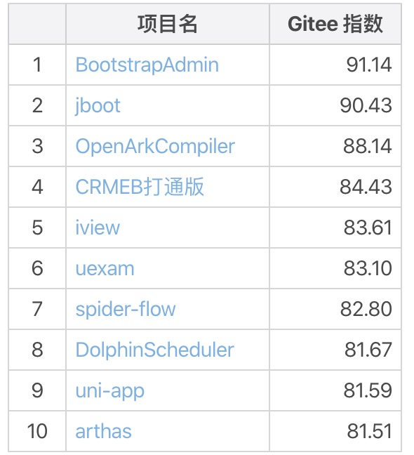

# Gitee 分析
Gitee.com 是开源中国旗下的代码托管平台，自 2013 年推出至今，已有超过 400 万开发者用户。我们对托管在 Gitee 的开源项目进行了统计分析，梳理和解读编程语言、功能分布的变化趋势，分析开发者在 Gitee 参与开源的情况，以期为观察国内开源的演进提供一个“本土平台”视角。

## 一、趋势与分布
### 1.1 编程语言趋势

**2019 Gitee 最受欢迎编程语言 TOP 10**

- Java 和 JavaScript 占据前两位，与去年排名一致，但 Java 开源项目占比小幅下降，而 JavaScript 开源项目占比有小幅上升。 结合下跌 4 位、排在第 10 的 Android 来看（Android 严格而言不是编程语言，本质上反映的主要是 Java 与 Kotlin 语言），Java 占比小幅下降可能与谷歌今年的 Kotlin First 战略有关，现在，如果开发 Android 应用，Kotlin 成为了与 Java 一样的一级语言，这或许分流了一部分 Java 开发者。

- Android 的整体下跌可能与 Kotlin 刚刚大规模进入 Android 开发者视野有关，毕竟项目从 Java 迁移到 Kotlin，或者开发者从 Java 切换到 Kotlin 来开发新项目都需要一些成本。但更主要是受到了近两年爆发的大前端趋势的影响。微信小程序、百度智能小程序、阿里小程序（支付宝、钉钉等）、快应用、混合、PWA 与 WebAssembly 等各种大前端技术在 2019 年争相进入落地期，催生出各种跨端方案，使得大前端热闹异常。聚焦到移动开发，由于这些技术解放了对底层平台的限制，移动开发不再局限于 Android 与 iOS 这样的特定端，许多开发者不再需要开发“移动 app”，直接用跨端框架开发“小程序”不仅更加便捷，对企业而言也是能够大幅降低研发和运维成本的性价比之选。同时，经济形势放缓、互联网寒冬也是 Android 开发的“式微”的一个背景原因。

- Python 今年上升一位，首次进入前三，反映出人工智能持续升温，在 2019 获得更多程序员认可。C++ 占比上升两位，虽然 Rust 今年大火，但当前底层基础设施性质的项目以及区块链、比特币等新兴基础项目主要还是使用 C/C++。

- Golang 首次进入前十，这与近年来云原生、容器化火爆不无关系。

**2019 Gitee 增速最快编程语言 TOP 10**

- 随着 Google 的 Flutter 框架的火热，Dart 语言受到广泛关注和使用，增速超过 250%。今年 Flutter 发布了迄今为止最重大的版本，一举成为多平台框架，支持移动、Web、桌面与嵌入式设备；而 Dart 也在与 C 的互操作、UI 构建和预编译本地可执行程序等特性上大幅改进。

- 注重高效、安全与并行的系统级编程语言 Rust 受到越来越多开发者的关注和使用。值得一提的是，国内目前并没有太多特别优秀的 Rust 落地实践，这可能与 Rust 语法晦涩难懂、学习曲线过于陡峭有关。但 Rust 是一门极具潜力的语言，并且获得了微软、谷歌等大厂的大力支持，未来可期。已有 Rust 开源项目的成长同样值得期待，比如内嵌式 Docker ——Rocker，针对基于 Linux 的资源受限的 IoT 系统，旨在提高其资源利用率和系统安全性，避免额外的性能开销。

- MATLAB 已连续两年以超过 130% 的速度增长，MATLAB 应用范围非常广，包括信号和图像处理、通讯、控制系统设计、测试和测量、财务建模和分析以及计算生物学等众多应用领域。

- TypeScript 稳扎稳打，目前是 JavaScript 中最受欢迎的方言，这与几大 TS 编写的前端框架在大前端领域的自由发挥有极大关系。

- Kotlin 的增长似乎不太理想，不过如前文所述，Kotlin 刚刚大规模进入开发者视野，开发者在迁移时会有一些成本，并且长期以来，Java 以其实用性与丰富的生态统治着 Android 开发领域，或许还没到退位的时候。

**2019 有更多新语言出现在 Gitee**

2019 年有许多特别小众的语言出现在 Gitee 上，除了小众，这些语言的特点是特别“极客”，都有很强烈的特色。除了广受欢迎的明星开源项目，我们也非常欣喜地看到一些相对小众、极客式的、具有无限潜力的项目和新尝试涌现。

### 1.2  功能分布
**2019 Gitee 新增开源项目功能分布 TOP 10**

- 程序开发和 WEB 应用开发占据前两位，与 2018 年排名一致，但占比都有所下降，可能的原因是开发者在更多尝试新的功能和新的方向。另外，人工智能这一功能分类首次进入前十，与去年相比增长了 60%。关于 2019 年人工智能的持续升温，不得不提到 2019 年 TensorFlow 与 PyTorch 的演进，TensorFlow 发布了 2.0，PyTorch 发布了 1.0，各自都带来了极其强大的新特性，同时，基于这两大框架，各大厂商也相继开源了各自的人工智能方案。

- 微信开发跌出前十。

- 其他开源类项目同比增长 52.11%，其中增速最快的三个子类别是硬件相关项目、物联网/边缘计算、图书/手册/教程。中国自主研发的物联网操作系统 RT-Thread 成功获得数百万美金的A轮投资，Raspberry Pi （树莓派）发布 4.0 版本，也让物联网、硬件项目持续受到开发者关注。

**2019 Gitee 新增开源项目二级功能分布 TOP 10**

硬件相关项目及 Vue 扩展组件首次进入前十，且排名上升幅度较大。硬件相关项目与 2018 年同比增长 139.29%，Vue 扩展组件与 2018 年同比增长 44.74%。

通过编程语言、功能与开源项目相关的数据榜，我们可以看出，Gitee 平台上的开发者与开源项目趋势也折射出国内当前软件开发行业的大趋势。

### 1.3  捐赠分布

**这些功能的开源项目在 2019 收获捐赠最多**

其中，这些二级功能的开源项目最受欢迎：

后台管理框架的捐赠者人数占比超过了四分之一，捐赠者占比最多的项目的一大共同特点是：应用性强、开箱即用。

### 1.4  开发者地域分布

使用 Gitee 的开发者分布排名前三位是：广东、北京、上海，整体分布没有太大变化，这与 IT 产业的整体布局相吻合。值得注意的是，河南省用户数增多，首次进入地域分布前十位。

## 二、开源治理与社区
2019 年，开源界精彩纷呈，开源受到了前所未有的关注，越来越多的开发者开始关注和了解开源文化、规则，开始认识到社区的重要性，开始尝试参与开源。我们从 Gitee 的数据也捕捉到了这一变化。

### 2.1  开源许可证
开发者对开源许可证的关注和规则意识在逐渐加强，2019 年，Gitee 使用开源协议的仓库占比 提升至 72%。

2019 年 8 月，Gitee 率先支持中国开源许可证 —— 木兰宽松许可证。目前， Gitee 上使用木兰宽松许可证的开源仓库已经超过 4000 个。

### 2.2  开源组织
Gitee 的开源组织数量在 2019 年以月均 24.46% 速度持续增长。

随着各大科技企业对开源的关注持续升温，越来越多优秀的开源组织陆续入驻 Gitee，如腾讯蓝鲸智云 与  TARS、滴滴开源、华为鸿蒙（ HarmonyOS ）与欧拉（openEuler）、蚂蚁金服 SOFASTACK 与 AntV、北京大学数字视频编解码技术国家工程实验室视频编码组、微众银行（WeBank）、科学大数据开源社区等。

### 2.3  协作方式

2019 年，很多人迈出了参与社区的第一步——提了第一个 Issue/PR，这是一个非常好的趋势。越来越多的人选择使用 Issue 来反馈问题、使用 PR 来参与代码贡献，以更好的方式参与开源协作。我们相信，未来会有更多开发者以更“开源”的方式参与开源，参与项目和社区的成长，感受开源所带来的便利和欣喜。

**Issue**
- 2019 年，开源项目的 Issue 数比去年增长 84.42% ，有 3.8 万开发者第一次在 Gitee 提 Issue，参与开源。
- 结合功能分类的维度来看，WEB应用开发-后台管理框架的讨论度最高，Issue 数占比 32.58%，比第二位的数据库开发包功能下的开源项目多出 27.5%，以绝对优势占据第一。
- 这些功能的开源项目新增 Issue 数最多：

**Pull Request**
- Pull Request 数比去年增长 48.96% 。

### 2.4  捐赠开源

除了提 Issue 和 PR，也有些人选择更“直接”的方式表达了对开源项目的认可，2016 年，Gitee 正式上线了捐赠功能。2019 年，近 2000 位开发者第一次在 Gitee 对开源项目捐赠，回馈开源。

### 2.5  GVP 参与度分析
GVP ( Gitee most Valuable Project ) - Gitee 最有价值开源项目计划，是经综合评定优选的开源项目展示平台，经两年多的发展，已有 200 余个项目，其中，2019 年有 93 个开源项目入选 GVP 。

这些项目的表现，在一定程度上反映了本土优秀开源项目的情况，我们通过 Gitee 指数、Star、Issue、Pull Request、贡献者等维度对其进行了分析：

**综合分析**

Gitee 指数是 2018 年底推出的一项功能，从代码活跃度、社区活跃度、团队健康、流行趋势、影响力这 5 个维度对开源项目进行分析，以直观数值的形式来展示对一个开源项目各方位的指标综合度量。
- 在 2019 年 Gitee 指数排名前 50 的开源项目中，GVP 占据 41 个席位，Gitee 指数普遍超过 80 分。

**2019 GVP- Gitee 指数排名 TOP 10**

**Star、Issue、Pull Request**
- 2019 年 Gitee 新增 Star 最多的 TOP 50 开源项目中，有 37 个 GVP  项目。
- 2019 年，平均每个 GVP 项目的 Issue 数比去年增长 119%，Pull Request 数增长 71%。

**贡献者**
- 2019 年，有 79% 的 GVP 项目新增超过 2 位贡献者，50% 的 GVP 项目贡献者增长超过 5 人。GVP 项目贡献者人数分布情况：

GVP 项目贡献者人数普遍较多，一方面反映出有更多开发者愿意为优秀项目贡献代码，成为社区的一员；另一方面也体现了运作良好的社区对项目健康成长的意义。

> 代码与社区是相辅相成的关系，优质的项目总是可以吸引更多贡献者，而社区也为项目成长提供了更多灵感与力量。我们期待越来越多开发者以更高效、社区化的方式参与开源，越来越多的开源项目在社区中汲取营养、发展壮大。
> —— Gitee.com（统计截至 2019 年 12 月 20 日）

